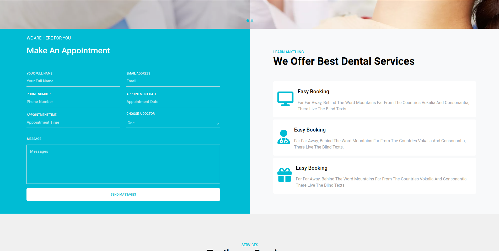
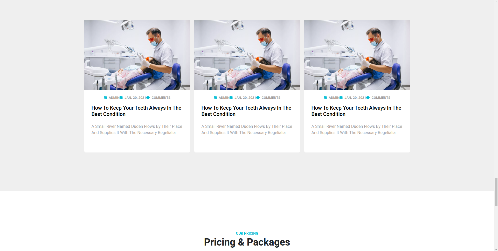
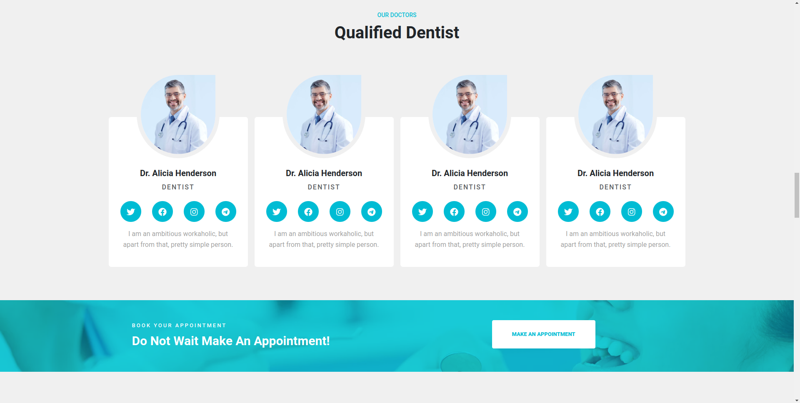

# Toothcare Template

This project is a React-based resume template built using Bootstrap as the styling framework. It was initially cloned from the incredible [Toothcare Template](https://preview.colorlib.com/#toothcare) created by [colorlib](https://colorlib.com/). A huge thank you to them for providing the foundation for this project!

## Overview

This template is designed to showcase my professional experience, skills, and accomplishments in a clean and visually appealing format. It utilizes React components for seamless interactivity and Bootstrap for a responsive layout across various devices.

### Features

- **Responsive Design**: Ensures compatibility across devices for a seamless viewing experience.
- **Customizable Sections**: Easily modify and add sections to personalize your own template.
- **Interactive Elements**: Utilizes React components for dynamic and engaging content presentation.

## Project photos

## How to Use

1. Clone the repository or download the ZIP file.
2. Install dependencies using `npm install`.
3. Customize the template by editing the React components.
4. Run the application using `npm start`.

Feel free to fork this repository and tailor it to suit your preferences!

## Show Your Support 🌟

If you find this template helpful, please consider giving it a star on GitHub. Your support means a lot and motivates me to continue improving it for the community!

Happy coding! 👩‍💻🚀
